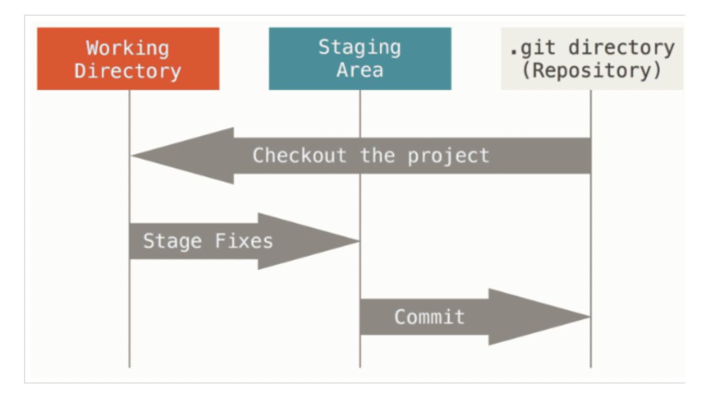

## SOP for the Gip Clone Set-up

### Step1. Set up the GIT account in the local machine
* git config --global user.name XXX
* git config --global user.email XXX

### Step 2.Make the repository

### Step 3. Clone repository

* git clone https://.....git

### Use the text editor to push the message to github

